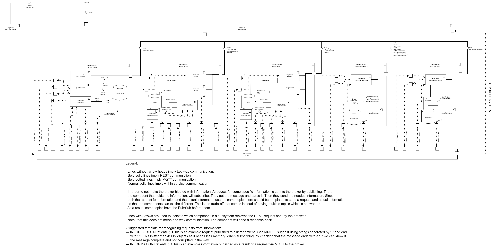

<h2 align="center">AppointDent</h2>

&#129463;&#129701; `AppointDent` is a **full-stack web application** that allows residents of Sweden
manage their dentist appointments, as well as a tool for dentists to organize
their work. 

 

**Table of Contents**

- [Introduction](#introduction)
- [Tech-stack](#tech-stack)
- [Pre-Requirements](#pre-requirements)
  - [Installation \& Setup](#installation--setup)
  - [Usage](#usage)
  - [API](#api)
- [System's Overview](#systems-overview)
  - [Entity Relationship Diagram](#entity-relationship-diagram)
  - [Component Diagram](#component-diagram)
  - [Deployment Diagram](#deployment-diagram)
- [Development team](#development-team)

<!-- table of contents subject to be updated -->

## Introduction

**AppointDent** is a system that allows residents of **Sweden** to book dentist
appointments. A user can find available times and see the dentist on an
integrated map.

AppointDent allows users to book appointments, cancel them, as well as receive
notifications about their bookings. The dentists in our system make use of a
calendar to navigate their appointments and manage their availability.

The solution is based on a **distributed system** infrastructure that combines
various architectural styles, namely **microservices**, **publish-subscribe**
and **client-server**.

## Tech-stack

- TypeScript
- Express.js
- Solid.js
- Sqlite3
- Tailwind

## Pre-Requirements

TBD

### Installation & Setup

TBD

### Usage

TBD

### API

TBD

## System's Overview

### Entity Relationship Diagram

### Component Diagram

### Deployment Diagram

## Development team

The project has been developed over the course of 10 weeks by the following:

| Name               | username (Chalmers GitLab) |
|--------------------|----------------------------|
| Agrima Singh       | @agrima                    |
| Mariia Zabolotnia  | @mariiaz                   |
| Alexander Säfström | @alesaf                    |
| Michal Spano       | @spano                     |
| Kaisa Arumeel      | @arumeel                   |
| Omid Khodaparast   | @omidk                     |