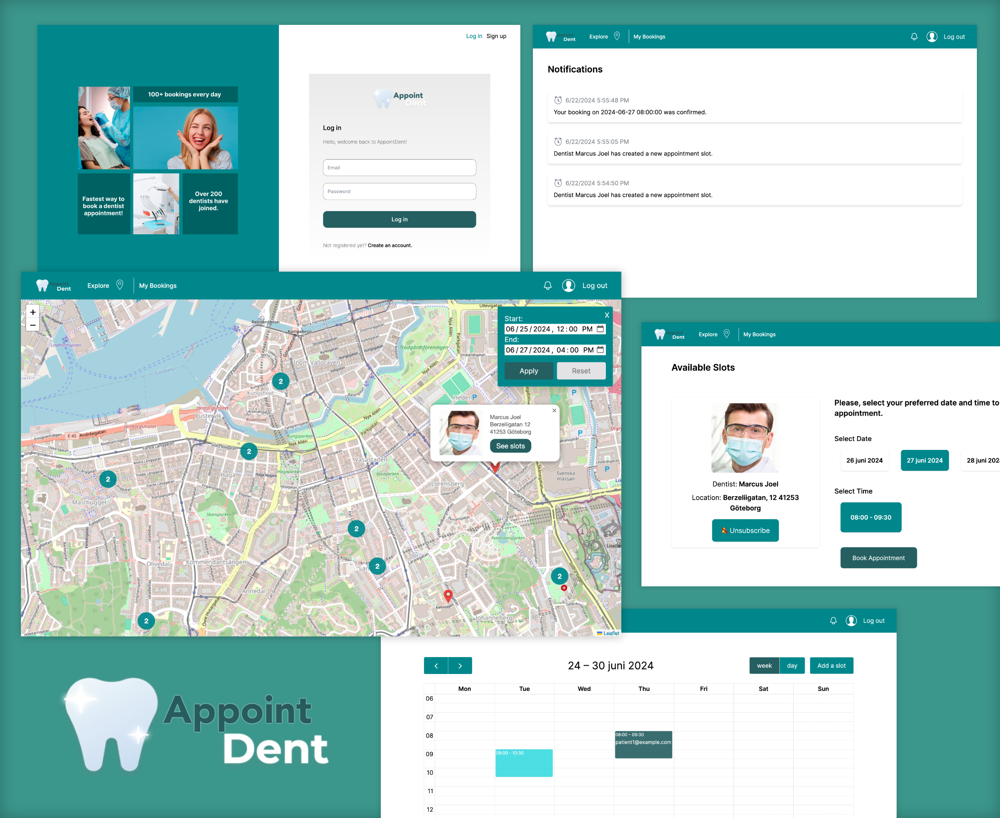

<h2 align="center">AppointDent &#129463;&#129701;</h2>

**AppointDent** is a **full-stack web application** that
allows residents of Sweden manage their dentist appointments, as well as a tool
for dentists to organize their work. The system, internally, relies on a
**distributed system** infrastructure that combines various architectural
styles, namely **microservices**, **publish-subscribe** and **client-server**.

 

**Table of Contents**

- [Introduction](#introduction)
- [Tech-stack](#tech-stack)
- [Pre-Requirements](#pre-requirements)
  - [Installation, Setup, and Running](#installation-setup-and-running)
- [Architecture](#architecture)
- [System's Overview](#systems-overview)
- [Continuous Integration](#continuous-integration)
- [Development team](#development-team)

## Introduction

**AppointDent** is a system that allows residents of **Sweden** to book dentist
appointments. A user can find available times and see the dentist on an
integrated map.

AppointDent allows users to book appointments, cancel them, as well as receive
notifications about their bookings. The dentists in our system make use of a
calendar to navigate their appointments and manage their availability.

The solution is based on a **distributed system** infrastructure that combines
various architectural styles, namely **microservices**, **publish-subscribe**
and **client-server**.

## Tech-stack

- [TypeScript](https://github.com/microsoft/TypeScript) (client, server, services)
- [Node.js](https://nodejs.org/en/) (client, server, services)
- [Vite.js](https://vitejs.dev/) (client)
- [Express.js](https://expressjs.com/) (server, services)
- [Solid.js](https://www.solidjs.com/) (client)
- [Sqlite3](https://www.sqlite.org/index.html) (`node` wrapper: [better-sqlite3](https://github.com/WiseLibs/better-sqlite3)) \[services\]
- [Tailwind CSS](https://tailwindcss.com/) (client)

## Pre-Requirements

The only technology that is utilized in building and running **all services**, **APIGateway (server)**, the **client**, and **stress-testing** is `Node.js`. Our project makes use of version `18.x.x`. Ensure that you have a compatible version installed on your machine (we recommend `18.12.2`). Read more about `Node.js` (and `npm`) [here](https://nodejs.org/en/).

For the `Solid.js` framework, we recommend using `npm` as the package manager and installing the version from the `package.json` file with `Vite.js` as the build tool.
Alternatively, install `^1.7.8` version of `Solid.js` (+`^4.4.5` of `Vite.js`) with the help of your preferred package manager/environment utility.

In terms of **stress-testing** the system, we recommend using the **latest** version of [`k6`](https://k6.io/). Navigate to [`stress-testing`](./stress-testing/README.md) for more information.

### Installation, Setup, and Running

This repository utilizes a **monorepo** structure, where the individual sub-folders represent a particular component of the system, wherein each component has its own `README.md` file.

The file contains the instructions on how to install all dependencies, it explains the structure of the directory, and it lists all the available scripts (with possible clarifications).

The following is a list of the available sub-folders:

- [**client**](./client/README.md): the client-side application.
- [**server**](./server/README.md): the server-side application (informally, the `APIGateway/Proxy`).
- [**services/admin-service**](./services/admin-service/README.md): the additional service that adds an abstraction of an admin to observe the system's state and trends.
- [**services/appointment-service**](./services/appointment-service/README.md): the service that handles all the appointment-related operations.
- [**services/dentist-service**](./services/dentist-service/README.md): the service that handles all the dentist-related operations.
- [**services/notification-service**](./services/notification-service/README.md): the service that enables the system to send notifications to the users upon certain events.
- [**services/patient-service**](./services/patient-service/README.md): the service that handles all the patient-related operations.
- [**services/session-service**](./services/session-service/README.md): a central service that handles all sessions of the users to enforce authentication and authorization.
- [**stress-testing**](./stress-testing/README.md): a folder that contains the scripts that are used to stress-test the system at a high load.

> [!NOTE]
> The `services` are not meant to be run individually, but rather as a part of
> the `server` application. They can be run individually for testing purposes
> or for the ease of development.

## Architecture

Our system is a **distributed** one and we have therefore decided to use a
**Microservices-based architecture**. This means that different services are to
be installed on different computers and are completely independent. The `MQTT`
(Message Queue Telemetry Transport) protocol is implemented as the primary
communication utility between the individual services of our system.
See our [Component Diagram](#systems-overview) for a detailed overview of the
architecture in use.

Furthermore, several other decisions that have a substantial
impact on the architecture that the team members dealt with during the project's
development may be traced with the [**ADRs**](https://git.chalmers.se/courses/dit355/2023/student-teams/dit356-2023-02/group-02/-/tree/main/docs/adrs?ref_type=heads).

## System's Overview

The following section aims to provide an overview of the **system's architecture**, as well as the **deployment strategy**. The individual diagrams can observed when clicking on the dropdowns.

  
1. Entity Relationship (ER) Diagram

  

  
2. Component Diagram

  

  
3. Deployment Diagram

  

## Continuous Integration

The development team made use of the **continuos integration (CI)** testing
practice to improve the development process model (which was **Scrum**) that was
used in the development of the system. This allowed the team to continuously
build and test the code in order to prevent pushing defective code into the
**main** branch.
The team made use of **Postman** as means of integration testing of the backend
and the database of the system. Moreover, the team made use of static analysis
(**ESLint**) to make sure good quality and readable code with no syntax bug is
pushed into the **main** branch. 
In order to make use of CI, the team made use of **GitLab's CI/CD** feature. The
[`gitlab-ci.yml`](https://github.com/michalspano/AppointDent/blob/main/.gitlab-ci.yml)
file contains the instructions that are used by GitLab to run
**Postman** tests, statically analyze code, and build the system.
> [!IMPORTANT]
> The project was initially developed on the GitLab platform, but was later
> migrated to GitHub. However, the CI/CD pipeline was not migrated yet, hence
> the pipeline is not functional on GitHub.

## Development team

The project has been developed over the course of **10 weeks** by the following:

| Name               | username (GitHub) |
|--------------------|----------------------------|
| Agrima Singh       | @agrimasingh2503           |
| Mariia Zabolotnia  | @marichkazb                |
| Alexander Säfström | @starkbamse                |
| Michal Spano       | @michalspano               |
| Kaisa Arumeel      | @kaisaarumeel              |
| Omid Khodaparast   | @OmidKhodaparast2002       |
