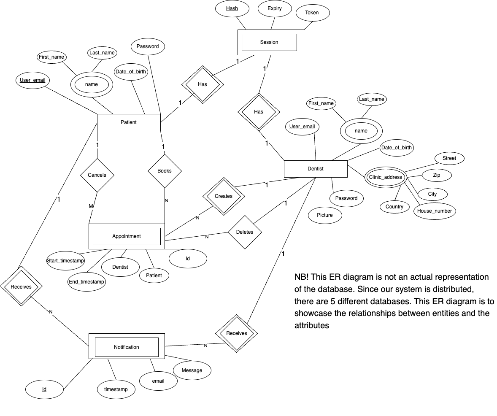

# AppointDent

## Introduction

AppointDent is a service that allows residents of Gothenburg to book dentist appointments. A user can find available times and see the dentist on a map. AppointDent allows users to book times, cancel them as well as get notifications about their bookings. The dentists in our service can see their calendar, add available slots and cancel appointments.

The solution is based on a distributed system that combines various architectural styles. ​

## Entity Relationship Diagram

## Pre-Requirements
TBD
## Getting started
TBD
## Technologies used

- TypeScript
- Express.js
- Solid.js
- Postgresql
- Tailwind

## Development team
Agrima Singh - @agrima 

Mariia Zabolotnia - @mariiaz

Alexander Säfström - @alesaf

Michal Spano - @spano

Kaisa Arumeel - @arumeel

Omid Khodaparast - @omidk

